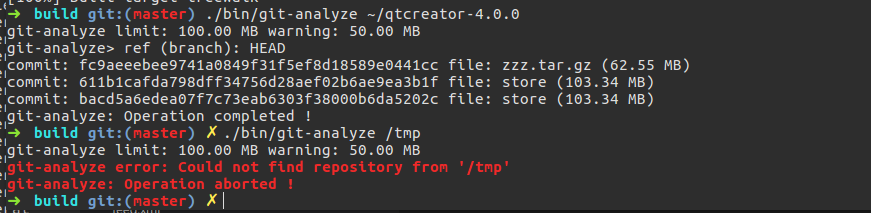

# Git Analyze tool

在用户使用 git 作为版本控制工具时,可能会将一些体积较大的文件提交到历史记录之中,由于 git 是一个分布式的版本控制系统,
并且基于快照的存储特性,这个时候,用户的存储库提交将变得非常大. git-analyze 是一个可以帮助用户检索出从哪一次提交
引入了原始体积超过限制的文件. git-rollback 则可以根据分支上的 commit 和从当前回退的版本数实现回滚,并且保留当前
工作目录的文件不改变,用户可以重新创建提交.

## 构建

任意平台都需要克隆代码

```
git clone --recursive https://gitee.com/oscstudio/git-analyze.git
```

本项目依赖 CMake 构建, 在 Windows 上,你可以从 cmake.org 下载符合你系统版本的 [CMake](https://cmake.org/download/) ,
使用 CMake 生成 Visual Studio 项目文件,在使用 CMake 生成 Visual Studio 项目文件之前,需要在环境变量中识别 Visual C++ 编译器的环境变量,
所以你可以新建一个类似于下面的批处理代码.

```bat
@echo off
::Find CMake Path
call "%VS140COMNTOOLS%\VsDevCmd.bat"
SET PATH=%PATH%;C:\Program Files\CMake\bin
cmd /k
```

其中 CMake 的安装路径可能有所差异.一切以实际为准.

启动命令行后,运行

```bash
mkdir build
cd build
cmake -G "Visual Studio 14" ..
```

 然后执行

```bash
msbuild git-analyze.sln /p:Configuration=Release
cpack
```

然后运行安装程序安装即可.

或者可以使用 Visual Studio 打开项目文件.

对于 CMake 的集成, 你同样可以使用作者的 [Clangbuilder](https://github.com/fstudio/clangbuilder) ,只需要在 ClangbuilderUI 中选择相应的
Visual Studio 版本,然后点击 **Startup Env** 按钮即可.

在 Linux 或者 Windows Subsystem for Linux (Bash on Windows) 中,你需要先安装 GCC G++ CMake 等工具.

>mkdir build &&cd build &&cmake -DCMAKE_BUILD_TYPE=Release .. -DCMAKE_INSTALL_PREFIX=/opt/oscstudio &&make &&make install

## Analyze 工具

git-analyze 命令行参数
```sh
OVERVIEW: GIT analyze tools
Usage: git-analyze <options>...] [--] [<pathspec>...] [<refs|branches> ...]
OPTIONS:
  -h [--help]      print usage and exit
  --limitsize      set analyze engine limit blob size
  --warnsize       set analyze engine warn blob size
  --timeout        set analyze engine lifycycle
  --who            show who is commit author
  --all            analyze will scanf all refs
```

默认情况下, git-analyze 扫描当前目录的仓库的 HEAD 指向的分支,如果要扫描其他目录或者其他分支需要额外的设置参数,
仓库目录可以是工作目录的根目录和裸仓库的目录, 分支名可以使用引用或者本地分支名,二者相对顺序必须与下相同.

>git-analyze /path/to/repo master

其中 limitsize warnsize 参数都是整数,单位是 MB 默认值为 100 MB 和 50 MB, timeout 单位是秒,可以不设置, 这几个都可以使用 --limitsize=100 或者 --limitsize 100 这样的格式.

who 这个参数是一个开关,单命令行参数中存在 --who 时, 扫描到大文件时将显示提交 作者 和 提交信息.

all 这个开关如果开启时,将扫描所有的引用.

这些参数没有顺序要求.

例图:



## Rollback 工具

git-rollback 命令行参数

```sh
OVERVIEW: GIT rollback tools
Usage: git-rollback <options>...] [--] [<pathspec>...] [<refs|branches> ...]
OPTIONS:
  -h [--help]      print usage and exit
  --git-dir        set rollback repository path
  --backid         set rollback commit id
  --backrev        set rollback current back X rev
  --refname        set rollback current reference name
  --force          force gc prune
```
参数格式与 git-analyze 类似, --force 将强制运行 git gc 并清除悬空对象. 当 未指定 git-dir 时,为当前目录,未指定 refname 时,为 HEAD 指向的分支.

## Cheat 工具

git-cheat 可以基于当前分支创建一个只有一个 commit 的分支，此分支的提交信息，树对象等都与当前分支
一致，但没有父提交。很容易看到的一个场景是，用户清理项目后，创建一个提交，然后在此提交的基础上
使用 git-cheat 开源。

命令格式：

```shell
git-cheat branch commit-message
```

## Pre-Commit 工具

pre-commit 是 git 的一类钩子，当用户创建提交，也就是 git commit -m 后，如果存储库中有此类钩子，
git-commit 就会执行 pre-commit 钩子，用户在创建提交时，很容易将大文件或者二进制文件提交到存储库，
等到推送到代码托管平台被拒绝时撤销更改就非常麻烦了。使用 pre-commit 可以避免此类问题，
用户将 pre-commit 软链到 `.git/hooks/pre-commit` 就行了，如果要修改配置，可以使用 git config 修改，
git config 添加 --global 参数时修改全局设置。

这里 limitsize 即限制文件大小，单位可以是 K M G 不区分大小写。warnsize 是警告提示大文件，大小为 limitszie 的一半就可以了。

而 filters 是一个正则表达式，过滤后缀名的，一般网络上可以找到。filterbroken 是设置当存在过滤文件时是否终止提交。默认为 false。

```shell
git config commit.limitsize 100M # limit file size
git config commit.warnsize 50M # report warning file size
git config commit.filters "\.(exe|obj|pdb)$" # filter regex
git config commit.filterbroken true # filter broken when find
```

## Git Complete 工具

此工具创建 整整一年的提交

```shell
git-complete dir branch 'commit message' 2016
```

## 与 GIT 整合

git 支持使用 git subcommand 的格式运行特定命令,比如 git add 对应的命令就是 git-add , 当用户需要直接运行 git analyze 这种方式运行这些命令,
有几种方法可以做到,第一种是将 git-analyze 加入环境变量,然后可以直接运行

```bash
 git analyze . refs/heads/master
 git rollback --backrev 1
 ```

同样也可以使用软链接的方式将命令链接到系统目录, 在 POSIX 系统中,或者 Windows Subsystem for Linux 可以使用 ln -s , 在 Windows 中
可以使用 mklink  /d .

## Copyright

Author: Force Charlie  
Copyright &copy; 2017, GITEE.COM, All Rights Reserved.
